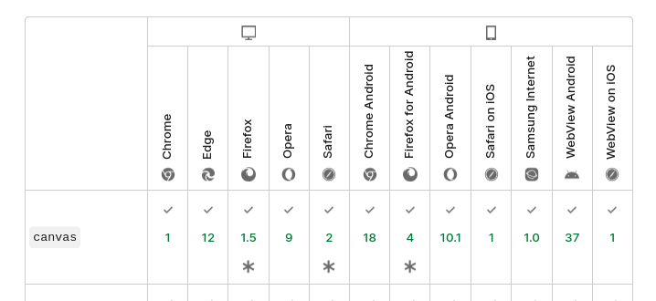

# Browser APIS

- Canvas
- Storage

## Canvas

Canvas é uma poderosa ferramenta que permite criar gráficos, animações, e renderizar elementos visualmente no HTML usando JavaScript. Podemos utiliza-lo a partir do elemento \<canvas\> do HTML.

O elemento \<canvas\> não é suportado por alguns navegadores antigos, mas é suportado em versões recentes da maioria dos navegadores. 

[Compatibilidade do canvas com navegadores](https://developer.mozilla.org/pt-BR/docs/Web/HTML/Element/canvas)


### Utilizando o canvas

Em uma página html simples, podemos inserir um elemento canvas que terá, por padrão, o tamanho  de 300px x 150px (largura x altura). Estas dimensões podem ser alterado.

Para utilizar o canvas é necessário inserir o elemento. Neste exemplo foi aplicado o *background* para visualizarmos a área de sua renderização.

```html
    <!DOCTYPE html>
    <head>
        <title>Canvas: Lab1 - Utilização</title>
    </head>
    <body>
        <canvas style="background-color: gray;"></canvas>
    </body>
    </html>
```
#### Lab1 - Utilização Básica

Para alterar o tamanho basta insirir as propriedades width e height no elemento:

```html
<canvas style="background-color: gray;" width="800" height="800"></canvas>
```

#### Lab2 - Contexto

O <canvas> cria uma superfície de desenho de tamanho fixo que expõe um ou mais contextos de renderização, que são usados para criar e manipular o conteúdo mostrado. Vamos nos concentrar no contexto de renderização 2D.

Por padrão o canvas é branco. Para mostrar alguma coisa, primeiro um script precisa acessar o contexto de renderização e desenhar sobre ele. 

```js
// contexto

const canvas = document.querySelector("canvas");
const ctx = canvas.getContext("2d");

```

Para desenhar qualquer forma precisamos usar esse contexto para acessar os métodos. No exemplo a seguir vamos desenhar dois retângulos, dos quais um deles tem uma transparência. 

Para desenhar imagine o contexto como um pincel mágico. Antes de você utilizá-lo você deve dizer o estilo (cor) e em seguida definir a forma.


```js
// contexto
const canvas = document.querySelector("canvas");
const ctx = canvas.getContext("2d");

ctx.fillStyle = "rgb(200,0,0)";
ctx.fillRect(10, 10, 55, 50);

ctx.fillStyle = "rgba(0, 0, 200, 0.5)";
ctx.fillRect(30, 30, 55, 50);
```

    Observando o valores aplicados no estílo e na forma, o que eles representam ?

### Estílo do Contexto

Para selecionar o estílo (cor) do desenho você pode usar os seguintes métodos:

- fillStyle: Define a cor ou estilo de preenchimento.
- strokeStyle: Define a cor ou estilo do contorno.
- lineWidth: Define a espessura das linhas de contorno.
- lineCap: Define o estilo das extremidades das linhas (butt, round, square).
- lineJoin: Define o estilo de união de linhas (round, bevel, miter).

### Formas

Com o contexto 2d do Canvas, é possível criar diversas formas geométricas usando as ferramentas básicas de desenho:
- Retângulos
- Círculos e Arcos
- Triângulos
- Linhas
- Poligonos

#### Lab3 - Retângulo

Para desenhar retângulos você pode usar os seguintes métodos:

- fillRect(x, y, width, height): Desenha um retângulo preenchido na posição (x, y) com a largura width e altura height.
- strokeRect(x, y, width, height): Desenha apenas o contorno do retângulo.
- clearRect(x, y, width, height): Limpa a área retangular, tornando-a transparente.

```js
// contexto (v2)
const canvas = document.querySelector("canvas");
const ctx = canvas.getContext("2d");

ctx.fillStyle = "rgb(200,0,0)";
ctx.fillRect(10, 10, 55, 50);

ctx.fillStyle = "rgba(0, 0, 200, 0.5)";
ctx.strokeRect(100, 100, 55, 50);
```
#### Lab4 - Arcos e Círculos

Para desenhar círculos ou partes de círculos (arcos) utilizados o método arc e arcTo


- arc(x, y, radius, startAngle, endAngle, anticlockwise): Desenha um arco ou círculo no ponto (x, y) com o raio especificado e os ângulos de início e fim (em radianos).
- arcTo(x1, y1, x2, y2, radius): Desenha um arco com o ponto de tangência especificado.


```js
const canvas = document.querySelector("canvas");
const ctx = canvas.getContext("2d");


ctx.arc(100, 100, 100, 0, 360)
ctx.stroke();
```

#### Lab5 - Linhas

Linhas podem ser desenhadas com pontos conectados:


```js

const canvas = document.querySelector("canvas");
const ctx = canvas.getContext("2d");

ctx.beginPath();
ctx.moveTo(100, 100); 
ctx.lineTo(500, 500); 
ctx.stroke(); 

```


#### Lab6 - Triângulos

Para criar triângulos devemos realizar uma sequência de desenhos de linhas com suas extremidades ligadas.

```js

const canvas = document.querySelector("canvas");
const ctx = canvas.getContext("2d");

ctx.beginPath();
ctx.moveTo(100, 100); // Ponto 1
ctx.lineTo(150, 200); // Ponto 2
ctx.lineTo(50, 200);  // Ponto 3
ctx.closePath(); // Fecha o caminho
ctx.fillStyle = 'green';
ctx.fill(); // Preenche o triângulo
ctx.stroke(); 
```

#### Lab7 - Polígonos

Polígonos podem ser desenhados usando múltiplas chamadas de lineTo:

```js
const canvas = document.querySelector("canvas");
const ctx = canvas.getContext("2d");

ctx.beginPath();
ctx.moveTo(150, 50); // Ponto inicial
ctx.lineTo(200, 150); // Ponto 2
ctx.lineTo(100, 150); // Ponto 3
ctx.closePath(); // Fecha o polígono
ctx.fillStyle = 'orange';
ctx.fill();
ctx.stroke();

```
#### Lab8 - Coordenadas do Canvas

Observe que a partir de várias linhas desenhas podemos visualizar o sistema de coordenadas que o canvas utiliza.

```js
const canvas = document.querySelector("canvas");
const ctx = canvas.getContext("2d");

ctx.beginPath();

ctx.lineTo(500, 500); 
ctx.stroke();

ctx.beginPath();
ctx.moveTo(0, 0); 
for (let i = 0; i < 800; i += 10){
    ctx.lineTo(i, 600)
    ctx.moveTo(i+10, 0); 
}
for (let i = 0; i < 600; i += 10){
    ctx.lineTo(800, i)
    ctx.moveTo(0, i+10); 
}
ctx.stroke();

```

#### Lab9 - Formas com curvas

Use curvas de Bézier ou quadráticas para formas mais complexas.

```js
const canvas = document.querySelector("canvas");
const ctx = canvas.getContext("2d");

ctx.beginPath();
ctx.moveTo(50, 200); // Ponto inicial
ctx.bezierCurveTo(150, 100, 250, 300, 350, 200); // 2 pontos de controle e o final
ctx.stroke();

```

#### Lab10 - Elipses 

Use o método ellipse para desenhar elipses.

```js
    const canvas = document.querySelector("canvas");
        const ctx = canvas.getContext("2d");

        ctx.beginPath();
        ctx.ellipse(200, 150, 100, 50, 0, 0, Math.PI * 2); // (x, y, raioX, raioY, rotação, início, fim)
        ctx.stroke();

```

#### Lab11 - Formas Complexas

Misture os métodos para fazer formas mais complexas

```js
 const canvas = document.querySelector("canvas");
        const ctx = canvas.getContext("2d");

        ctx.beginPath();
        ctx.moveTo(150, 200);
        ctx.bezierCurveTo(100, 100, 50, 200, 150, 300); // Lado esquerdo
        ctx.bezierCurveTo(250, 200, 200, 100, 150, 200); // Lado direito
        ctx.fillStyle = 'red';
        ctx.fill();
        ctx.stroke();
```

## Projeto 1: Criando um Semáforo com Círculos no Canvas

#### Objetivo
Neste tutorial, vamos aprender a criar um semáforo utilizando a tag `<canvas>` no HTML e JavaScript. Ele terá três luzes (vermelha, amarela e verde) desenhadas com círculos. Além disso, vamos adicionar uma interação onde as luzes se alternam automaticamente a cada 2 segundos.


---

### Passo 1: Configuração Inicial

#### Estrutura HTML

Crie um arquivo chamado `index.html` com a seguinte estrutura básica:

```html
<!DOCTYPE html>
<html lang="pt-br">
<head>
    <meta charset="UTF-8">
    <meta name="viewport" content="width=device-width, initial-scale=1.0">
    <title>Semáforo com Canvas</title>
    <style>
        canvas {
            display: block;
            margin: 20px auto;
            border: 2px solid black;
            background-color: #444;
        }
    </style>
</head>
<body>
    <h1 style="text-align: center;">Semáforo com Canvas</h1>
    <canvas id="semaforoCanvas" width="150" height="400"></canvas>
    <script src="semaforo.js"></script>
</body>
</html>
```

#### Explicação:
1. O `<canvas>` com o `id="semaforoCanvas"` será usado para desenhar o semáforo.
2. O CSS define bordas e cores de fundo para o canvas.

---

### Passo 2: Desenhando o Corpo do Semáforo

Crie um arquivo chamado `semaforo.js` e adicione o seguinte código:

```javascript
const canvas = document.getElementById("semaforoCanvas");
const ctx = canvas.getContext("2d");

// Dimensões do semáforo
const width = 100; // Largura
const height = 300; // Altura
const xPos = (canvas.width - width) / 2; // Centraliza horizontalmente
const yPos = 50; // Posição no eixo Y

// Corpo do semáforo
ctx.fillStyle = "black";
ctx.fillRect(xPos, yPos, width, height);
```

#### Explicação:
1. `fillRect(x, y, largura, altura)` desenha o retângulo representando o corpo do semáforo.
2. As posições `xPos` e `yPos` centralizam o semáforo no canvas.

---

### Passo 3: Desenhando as Luzes

Adicione ao `semaforo.js`:

```javascript
// Coordenadas das luzes
const lightRadius = 30;
const lightX = canvas.width / 2; // Posição horizontal centralizada
const lightsY = [90, 190, 290]; // Posições verticais para as luzes

// Função para desenhar uma luz
function drawLight(y, color) {
    ctx.beginPath();
    ctx.arc(lightX, y, lightRadius, 0, 2 * Math.PI);
    ctx.fillStyle = color;
    ctx.fill();
    ctx.strokeStyle = "black";
    ctx.lineWidth = 2;
    ctx.stroke();
}

// Luzes apagadas inicialmente
lightsY.forEach(y => drawLight(y, "gray"));
```

#### Explicação:
1. `arc(x, y, raio, início, fim)` desenha os círculos das luzes.
2. As luzes começam apagadas (`gray`) para representar o estado inicial.

---

### Passo 4: Adicionando a Lógica de Alternância

Agora vamos fazer as luzes alternarem automaticamente a cada 2 segundos. Adicione ao `semaforo.js`:

```javascript
let currentLight = 0; // Índice da luz atual (0 = vermelho, 1 = amarelo, 2 = verde)
const lightColors = ["red", "yellow", "green"]; // Cores das luzes

function updateTrafficLight() {
    // Apagar todas as luzes
    lightsY.forEach(y => drawLight(y, "gray"));

    // Acender a luz atual
    drawLight(lightsY[currentLight], lightColors[currentLight]);

    // Avançar para a próxima luz
    currentLight = (currentLight + 1) % lightColors.length;
}

// Alternar as luzes a cada 2 segundos
setInterval(updateTrafficLight, 2000);
```

#### Explicação:
1. `setInterval()` executa a função `updateTrafficLight` a cada 2 segundos.
2. `currentLight` alterna entre os índices 0, 1 e 2 (vermelho, amarelo e verde).
3. A lógica apaga todas as luzes antes de acender a atual.

---

### Passo 5: Testando o Semáforo

Salve os arquivos e abra o `index.html` em um navegador. O semáforo agora alterna automaticamente entre as luzes vermelho, amarelo e verde!

---

### Código Final: `semaforo.js`

```javascript
const canvas = document.getElementById("semaforoCanvas");
const ctx = canvas.getContext("2d");

// Dimensões do semáforo
const width = 100;
const height = 300;
const xPos = (canvas.width - width) / 2;
const yPos = 50;

// Corpo do semáforo
ctx.fillStyle = "black";
ctx.fillRect(xPos, yPos, width, height);

// Coordenadas das luzes
const lightRadius = 30;
const lightX = canvas.width / 2;
const lightsY = [90, 190, 290];

// Função para desenhar uma luz
function drawLight(y, color) {
    ctx.beginPath();
    ctx.arc(lightX, y, lightRadius, 0, 2 * Math.PI);
    ctx.fillStyle = color;
    ctx.fill();
    ctx.strokeStyle = "black";
    ctx.lineWidth = 2;
    ctx.stroke();
}

// Luzes apagadas inicialmente
lightsY.forEach(y => drawLight(y, "gray"));

// Alternância das luzes
let currentLight = 0;
const lightColors = ["red", "yellow", "green"];

function updateTrafficLight() {
    lightsY.forEach(y => drawLight(y, "gray")); // Apagar todas as luzes
    drawLight(lightsY[currentLight], lightColors[currentLight]); // Acender luz atual
    currentLight = (currentLight + 1) % lightColors.length; // Alternar luz
}

// Alternar as luzes a cada 2 segundos
setInterval(updateTrafficLight, 2000);
```

---

### Melhorias Futuras

- **Botão de Controle:** Adicione um botão para pausar ou reiniciar o semáforo.
- **Velocidade Ajustável:** Permita ao usuário escolher o tempo de alternância.
- **Som:** Adicione sons para cada mudança de luz.


## Projeto 2: Criando uma Paisagem no Canvas

### Objetivo
Neste tutorial, vamos aprender a desenhar uma paisagem básica usando o elemento `<canvas>` do HTML e JavaScript. A paisagem terá os seguintes elementos: 
- Um **céu** (retângulo).
- **Montanhas** (linhas).
- Uma **casa** com telhado e chaminé (retângulos e triângulo).
- Um **sol** (círculo).
- **Grama** (linhas).


### Passo 1: Configuração Inicial

#### Estrutura HTML

Crie um arquivo chamado `index.html` com o seguinte código:

```html
<!DOCTYPE html>
<html lang="pt-br">
<head>
    <meta charset="UTF-8">
    <meta name="viewport" content="width=device-width, initial-scale=1.0">
    <title>Paisagem com Canvas</title>
    <style>
        canvas {
            display: block;
            margin: 20px auto;
            border: 2px solid black;
        }
    </style>
</head>
<body>
    <h1 style="text-align: center;">Paisagem no Canvas</h1>
    <canvas id="paisagemCanvas" width="800" height="500"></canvas>
    <script src="paisagem.js"></script>
</body>
</html>
```

#### Explicação:
- O `<canvas>` tem 800px de largura e 500px de altura.
- Ele está centralizado com margem automática e borda para facilitar a visualização.

---

### Passo 2: Configurando o Contexto do Canvas

Crie um arquivo chamado `paisagem.js` e adicione o seguinte código:

```javascript
// Configuração inicial
const canvas = document.getElementById("paisagemCanvas");
const ctx = canvas.getContext("2d");
```

Essa parte do código identifica o canvas no HTML e configura o contexto 2D necessário para desenhar.

---

### Passo 3: Criando o Céu

Adicione ao `paisagem.js`:

```javascript
// Desenhando o céu
ctx.fillStyle = "#87CEEB"; // Azul claro
ctx.fillRect(0, 0, canvas.width, canvas.height / 2);
```

#### Explicação:
1. `fillStyle` define a cor do céu.
2. `fillRect(x, y, largura, altura)` desenha um retângulo cobrindo a metade superior do canvas.

---

### Passo 4: Desenhando as Montanhas

Adicione ao `paisagem.js`:

```javascript
// Desenhando montanhas
ctx.beginPath();
ctx.moveTo(50, 250); // Base da primeira montanha
ctx.lineTo(200, 100); // Pico da primeira montanha
ctx.lineTo(350, 250); // Final da primeira montanha
ctx.closePath();
ctx.fillStyle = "#556B2F"; // Verde escuro
ctx.fill();

ctx.beginPath();
ctx.moveTo(300, 250); // Base da segunda montanha
ctx.lineTo(500, 50); // Pico da segunda montanha
ctx.lineTo(700, 250); // Final da segunda montanha
ctx.closePath();
ctx.fillStyle = "#6B8E23"; // Verde oliva
ctx.fill();
```

#### Explicação:
1. `beginPath()` inicia um novo caminho para desenhar as montanhas.
2. `moveTo(x, y)` e `lineTo(x, y)` criam linhas conectando pontos para formar triângulos.
3. `closePath()` conecta o último ponto ao primeiro.

---

### Passo 5: Desenhando o Sol

Adicione ao `paisagem.js`:

```javascript
// Desenhando o sol
ctx.beginPath();
ctx.arc(650, 80, 50, 0, 2 * Math.PI); // Sol (círculo)
ctx.fillStyle = "#FFD700"; // Amarelo dourado
ctx.fill();
ctx.strokeStyle = "#FFA500"; // Contorno laranja
ctx.lineWidth = 5;
ctx.stroke();
```

#### Explicação:
1. `arc(x, y, raio, início, fim)` desenha o círculo representando o sol.
2. `fill()` preenche o círculo e `stroke()` adiciona um contorno.

---

### Passo 6: Desenhando a Casa

Adicione ao `paisagem.js`:

```javascript
// Desenhando a base da casa
ctx.fillStyle = "#8B4513"; // Marrom
ctx.fillRect(150, 300, 200, 150);

// Desenhando o telhado
ctx.beginPath();
ctx.moveTo(150, 300); // Canto inferior esquerdo
ctx.lineTo(250, 200); // Pico do telhado
ctx.lineTo(350, 300); // Canto inferior direito
ctx.closePath();
ctx.fillStyle = "#A52A2A"; // Vermelho telha
ctx.fill();

// Desenhando a chaminé
ctx.fillStyle = "#8B0000"; // Vermelho escuro
ctx.fillRect(280, 220, 20, 50);

// Desenhando a porta
ctx.fillStyle = "#D2691E"; // Marrom claro
ctx.fillRect(220, 370, 60, 80);
```

#### Explicação:
1. A casa é composta por um retângulo para a base, um triângulo para o telhado, outro retângulo para a chaminé e outro menor para a porta.

---

### Passo 7: Adicionando a Grama

Adicione ao `paisagem.js`:

```javascript
// Desenhando a grama
ctx.fillStyle = "#228B22"; // Verde
ctx.fillRect(0, canvas.height / 2, canvas.width, canvas.height / 2);
```

#### Explicação:
Um retângulo verde é desenhado para preencher a parte inferior do canvas, representando a grama.

---

### Passo 8: Adicionando Detalhes (Janelas e Raios do Sol)

Adicione ao `paisagem.js`:

```javascript
// Desenhando janelas
ctx.fillStyle = "#87CEFA"; // Azul claro
ctx.fillRect(180, 320, 40, 40); // Janela esquerda
ctx.fillRect(280, 320, 40, 40); // Janela direita

// Desenhando raios do sol
for (let i = 0; i < 12; i++) {
    const angle = (i * Math.PI) / 6; // Ângulo para cada raio
    const x1 = 650 + 50 * Math.cos(angle); // Ponto inicial
    const y1 = 80 + 50 * Math.sin(angle);
    const x2 = 650 + 80 * Math.cos(angle); // Ponto final
    const y2 = 80 + 80 * Math.sin(angle);

    ctx.beginPath();
    ctx.moveTo(x1, y1);
    ctx.lineTo(x2, y2);
    ctx.strokeStyle = "#FFD700";
    ctx.lineWidth = 2;
    ctx.stroke();
}
```

---

### Código Final: `paisagem.js`

```javascript
const canvas = document.getElementById("paisagemCanvas");
const ctx = canvas.getContext("2d");

// Céu
ctx.fillStyle = "#87CEEB";
ctx.fillRect(0, 0, canvas.width, canvas.height / 2);

// Montanhas
ctx.beginPath();
ctx.moveTo(50, 250);
ctx.lineTo(200, 100);
ctx.lineTo(350, 250);
ctx.closePath();
ctx.fillStyle = "#556B2F";
ctx.fill();

ctx.beginPath();
ctx.moveTo(300, 250);
ctx.lineTo(500, 50);
ctx.lineTo(700, 250);
ctx.closePath();
ctx.fillStyle = "#6B8E23";
ctx.fill();

// Sol
ctx.beginPath();
ctx.arc(650, 80, 50, 0, 2 * Math.PI);
ctx.fillStyle = "#FFD700";
ctx.fill();
ctx.strokeStyle = "#FFA500";
ctx.lineWidth = 5;
ctx.stroke();

// Casa
ctx.fillStyle = "#8B4513";
ctx.fillRect(150, 300, 200, 150);

ctx.beginPath();
ctx.moveTo(150, 300);
ctx.lineTo(250, 200);
ctx.lineTo(350, 300);
ctx.closePath();
ctx.fillStyle = "#A52A2A";
ctx.fill();

ctx.fillStyle = "#8B0000";
ctx.fillRect(280, 220, 20, 50);

ctx.fillStyle = "#D2691E";
ctx.fillRect(220, 370, 60, 80);

// Grama
ctx.fillStyle = "#228B22";
ctx.fillRect(0, canvas.height / 2, canvas.width, canvas.height / 2);

// Janelas
ctx.fillStyle = "#87CEFA";
ctx.fillRect(180, 320, 40, 40);
ctx.fillRect(280, 320, 40, 40);

// Raios do Sol
for (let i = 0; i < 12; i++) {
    const angle = (i * Math.PI) / 6;
    const x1 = 650 + 50 * Math.cos(angle);
    const y1 = 80 + 50 * Math.sin(angle);
    const x2 = 650 + 80 * Math.cos(angle);
    const y2 = 80 + 80 * Math.sin(angle);

    ctx.beginPath();
    ctx.moveTo(x1, y1);
    ctx.lineTo(x2, y2);
    ctx.strokeStyle = "#FFD700";
    ctx.lineWidth = 2;
    ctx.stroke();
}
```

---

### Resultado Final
Salve os arquivos e abra o `index.html` no navegador. Você verá uma paisagem com céu, montanhas, sol, grama e uma casa.

### Melhorias Futuras
- **Nuvens:** Adicione círculos para criar nuvens no céu.
- **Árvores:** Use retângulos e círculos para desenhar árvores.


## Projeto 3 - Gráfico de Barras

Este tutorial ensina a desenhar gráficos de barras usando JavaScript e o elemento Canvas do HTML5. Ele abrange os seguintes pontos principais:

- Configuração do Projeto: Começa configurando um arquivo HTML e incluindo o script JavaScript necessário.

- Desenhando o Canvas: Explica como configurar e desenhar no canvas.

- Plotando os Dados: Mostra como plotar os dados no gráfico de barras, incluindo como configurar as cores e as dimensões das barras.

- Adicionando Etiquetas: Detalha como adicionar etiquetas ao gráfico para melhorar a legibilidade.

- Estilização: Oferece dicas sobre como estilizar o gráfico para torná-lo visualmente atraente.

### Gráfico de Barras

Gráficos de barras são ferramentas muito comuns usadas para representar dados numéricos. De relatórios financeiros a apresentações de PowerPoint e infográficos, os gráficos de barras são frequentemente utilizados porque oferecem uma visão dos dados numéricos que é muito fácil de entender.

Gráficos de barras representam dados numéricos usando barras, que são retângulos com larguras ou alturas proporcionais aos dados numéricos que representam.

Existem muitos tipos de gráficos de barras, por exemplo:

- gráficos de barras horizontais e gráficos de barras verticais dependendo da orientação do gráfico;
- gráficos de barras empilhadas ou gráficos de barras clássicos para representar várias séries de dados;
- gráficos de barras 2D ou 3D.

### Componentes de um Gráfico de Barras

Componentes de um Gráfico de Barras

Um gráfico de barras, independentemente do tipo, geralmente é composto pelos seguintes elementos principais:


Os dados do gráfico: são conjuntos de números e categorias associadas que são representados pelo gráfico. Nome da série de dados (1). A grade do gráfico (2): fornece um sistema de referência para que a representação visual possa ser facilmente compreendida. As barras (3): retângulos preenchidos com cores cujas dimensões são proporcionais aos dados representados. Legenda do gráfico (4): mostra a correspondência entre as cores usadas e os dados que elas representam.

Agora que conhecemos os componentes de um gráfico de barras, vamos ver como podemos escrever o código JavaScript para desenhar um gráfico como este.

### Configurando o Projeto JS

Para começar a desenhar usando JavaScript e o elemento canvas do HTML5, precisaremos configurar nosso projeto da seguinte forma:

Crie uma pasta para armazenar os arquivos do projeto; vamos chamar essa pasta de "bar-chart-tutorial".

Dentro da pasta do projeto, crie um arquivo e nomeie-o como index.html. Este arquivo conterá nosso código HTML.

Também dentro da pasta do projeto, crie um arquivo e nomeie-o como script.js. Este arquivo conterá o código JavaScript para desenhar o gráfico de barras.

Vamos manter as coisas bem simples e adicionar o seguinte código no index.html.

### Adicionando Algumas Funções Auxiliares

Desenhar o gráfico de barras só requer saber como desenhar dois elementos:

- desenhar uma linha: para desenhar as linhas da grade

- desenhar um retângulo preenchido com cor: para desenhar as barras do gráfico

Vamos criar as funções auxiliares em JavaScript para esses dois elementos. Adicionaremos as funções no nosso arquivo script.js.

```js
function drawLine(ctx, startX, startY, endX, endY,color){
    ctx.save();
    ctx.strokeStyle = color;
    ctx.beginPath();
    ctx.moveTo(startX,startY);
    ctx.lineTo(endX,endY);
    ctx.stroke();
    ctx.restore();
}
```

Estamos modificando as configurações de cor para o strokeStyle. Isso determina a cor usada para desenhar a linha. Usamos ctx.save() e ctx.restore() para que não afetemos as cores usadas fora desta função.

Desenhamos a linha chamando beginPath(). Isso informa ao contexto de desenho que estamos começando a desenhar algo novo no canvas. Usamos moveTo() para definir o ponto de partida, chamamos lineTo() para indicar o ponto final e, então, fazemos o desenho real chamando stroke().

Outra função auxiliar que precisamos é uma função para desenhar uma barra — que é um retângulo preenchido com cor. Vamos adicioná-la ao script.js:

```js
function drawBar(ctx, upperLeftCornerX, upperLeftCornerY, width, height,color){
    ctx.save();
    ctx.fillStyle=color;
    ctx.fillRect(upperLeftCornerX,upperLeftCornerY,width,height);
    ctx.restore();
}
```

### O Modelo de Dados do Gráfico de Barras

Agora que temos as funções auxiliares no lugar, vamos passar para o modelo de dados do gráfico. Todos os tipos de gráficos, incluindo gráficos de barras, têm um modelo de dados por trás deles. O modelo de dados é um conjunto estruturado de dados numéricos. Para este tutorial, usaremos uma série de dados de categorias e seus valores numéricos associados representando o número de discos de vinil na minha coleção de discos agrupados por gênero musical:

- Música clássica: 16

- Rock alternativo: 12

- Pop: 18

- Jazz: 32

Podemos representar isso em JavaScript na forma de um objeto. Passaremos esses dados para o nosso objeto BarChart junto com outras informações. Vamos adicioná-lo ao nosso arquivo script.js:


```js
{
    "Classical Music": 16, 
    "Alternative Rock": 12, 
    "Pop": 18, 
    "Jazz": 32,
}
```

### Implementando a Classe BarChart

A classe `BarChart` terá uma variedade de métodos para ajudar a separar o código em partes relacionadas. Diferentes componentes do gráfico de barras serão desenhados por métodos diferentes.

---

### Implementando o Componente Gráfico de Barras

Vamos implementar a classe e os métodos que realizarão o desenho do gráfico de barras. Adicione o seguinte código JavaScript ao seu arquivo `script.js`:

```javascript
class BarChart {
  constructor(options) {
    this.options = options;
    this.canvas = options.canvas;
    this.ctx = this.canvas.getContext("2d");
    this.colors = options.colors;
    this.titleOptions = options.titleOptions;
    this.maxValue = Math.max(...Object.values(this.options.data));
  }
  
  drawGridLines() {
    const canvasActualHeight = this.canvas.height - this.options.padding * 2;
    const canvasActualWidth = this.canvas.width - this.options.padding * 2;
    let gridValue = 0;
    while (gridValue <= this.maxValue) {
      const gridY = canvasActualHeight * (1 - gridValue / this.maxValue) + this.options.padding;
      
      drawLine(this.ctx, 0, gridY, this.canvas.width, gridY, this.options.gridColor);
      drawLine(this.ctx, 15, this.options.padding / 2, 15, gridY + this.options.padding / 2, this.options.gridColor);
      
      // Desenhar os marcadores da grade
      this.ctx.save();
      this.ctx.fillStyle = this.options.gridColor;
      this.ctx.textBaseline = "bottom";
      this.ctx.font = "bold 10px Arial";
      this.ctx.fillText(gridValue, 0, gridY - 2);
      this.ctx.restore();
      
      gridValue += this.options.gridScale;
    }
  }
  
  drawBars() {
    const canvasActualHeight = this.canvas.height - this.options.padding * 2;
    const canvasActualWidth = this.canvas.width - this.options.padding * 2;
    let barIndex = 0;
    const numberOfBars = Object.keys(this.options.data).length;
    const barSize = canvasActualWidth / numberOfBars;
    const values = Object.values(this.options.data);
    
    for (const val of values) {
      const barHeight = Math.round((canvasActualHeight * val) / this.maxValue);
      
      drawBar(
        this.ctx,
        this.options.padding + barIndex * barSize,
        this.canvas.height - barHeight - this.options.padding,
        barSize,
        barHeight,
        this.colors[barIndex % this.colors.length]
      );
      
      barIndex++;
    }
  }
  
  draw() {
    this.drawGridLines();
    this.drawBars();
  }
}
```

### Explicação da Classe

1. **Construtor**: 
   - Inicializa as propriedades usando os parâmetros fornecidos.
   - Armazena a referência ao canvas e cria o contexto de desenho.
   - Define as cores e o valor máximo dos dados para escalonar as barras.

2. **`drawGridLines()`**:
   - Desenha as linhas da grade e os marcadores.
   - Calcula a altura e largura reais do canvas considerando o `padding`.
   - Desenha cada linha da grade e escreve os valores correspondentes.

3. **`drawBars()`**:
   - Desenha as barras do gráfico.
   - Calcula a altura de cada barra proporcional ao valor máximo e o tamanho do canvas.
   - Usa cores alternadas fornecidas na propriedade `colors`.

### Usando o Componente Gráfico de Barras

Adicione o seguinte código ao seu arquivo `script.js` para criar e desenhar o gráfico:

```javascript
var myBarchart = new BarChart({
  canvas: myCanvas,
  padding: 40,
  gridScale: 5,
  gridColor: "black",
  data: {
    "Música Clássica": 16, 
    "Rock Alternativo": 12, 
    "Pop": 18, 
    "Jazz": 32,
  },
  colors: ["#a55ca5", "#67b6c7", "#bccd7a", "#eb9743"],
});
myBarchart.draw();
```


### Adicionando Nome da Série de Dados e Legenda

Para adicionar um título e uma legenda ao gráfico, expanda a classe `BarChart`:

```javascript
drawLabel() {
    this.ctx.save();
    this.ctx.textBaseline = "bottom";
    this.ctx.textAlign = this.titleOptions.align;
    this.ctx.fillStyle = this.titleOptions.fill;
    this.ctx.font = `${this.titleOptions.font.weight} ${this.titleOptions.font.size} ${this.titleOptions.font.family}`;
    
    let xPos = this.canvas.width / 2;
    if (this.titleOptions.align === "left") xPos = 10;
    if (this.titleOptions.align === "right") xPos = this.canvas.width - 10;
    
    this.ctx.fillText(this.options.seriesName, xPos, this.canvas.height);
    this.ctx.restore();
}

drawLegend() {
    let pIndex = 0;
    const legend = document.querySelector("legend[for='myCanvas']");
    const ul = document.createElement("ul");
    legend.append(ul);
    for (const ctg of Object.keys(this.options.data)) {
      const li = document.createElement("li");
      li.style.listStyle = "none";
      li.style.borderLeft = "20px solid " + this.colors[pIndex % this.colors.length];
      li.style.padding = "5px";
      li.textContent = ctg;
      ul.append(li);
      pIndex++;
    }
}

draw() {
    this.drawGridLines();
    this.drawBars();
    this.drawLabel();
    this.drawLegend();
}
```

Atualize a inicialização da classe:

```javascript
var myBarchart = new BarChart({
  canvas: myCanvas,
  seriesName: "Discos de Vinil",
  padding: 40,
  gridScale: 5,
  gridColor: "black",
  data: {
    "Música Clássica": 16, 
    "Rock Alternativo": 12, 
    "Pop": 18, 
    "Jazz": 32,
  },
  colors: ["#a55ca5", "#67b6c7", "#bccd7a", "#eb9743"],
  titleOptions: {
    align: "center",
    fill: "black",
    font: {
      weight: "bold",
      size: "18px",
      family: "Lato",
    },
  },
});
myBarchart.draw();
```

### Adicionando um Título e uma Legenda

Certifique-se de que o HTML tenha os elementos adequados:

```html
<html>
  <body>
    <canvas id="myCanvas" style="background: white;"></canvas>
    <legend for="myCanvas"></legend>
    <script type="text/javascript" src="script.js"></script>
  </body>
</html>
```

Após adicionar o código acima, o resultado será um gráfico de barras funcional com título e legenda.

## Projeto 4 - Criando uma Animação Interativa com Bolas em Movimento usando JavaScript

Neste tutorial, vamos desenvolver um projeto de animação no navegador onde diversas bolas coloridas se movem e colidem, mudando de cor. Além disso, teremos uma bola controlável que você pode mover usando as setas do teclado.

---

### 1. Configuração Inicial

Comece criando um arquivo HTML e um arquivo JavaScript para o projeto. O HTML irá definir o espaço do canvas, e o JavaScript será responsável por desenhar e animar as bolas.

---

### 2. Estrutura HTML
Crie um arquivo `index.html` com o seguinte conteúdo:
```html
<!DOCTYPE html>
<html lang="pt-br">
<head>
  <meta charset="UTF-8">
  <meta name="viewport" content="width=device-width, initial-scale=1.0">
  <title>Bolas em Movimento</title>
  <style>
    body {
      margin: 0;
      overflow: hidden;
    }
  </style>
</head>
<body>
  <canvas></canvas>
  <script src="script.js"></script>
</body>
</html>
```
**Explicação**:
- A tag `<canvas>` cria uma área para desenharmos as bolas.
- O JavaScript será vinculado no arquivo `script.js`.

---

### 3. Configurando o Canvas no JavaScript
Crie um arquivo `script.js` e adicione o seguinte código para configurar o canvas:
```javascript
const canvas = document.querySelector("canvas");
const ctx = canvas.getContext("2d");

const width = (canvas.width = window.innerWidth);
const height = (canvas.height = window.innerHeight);
```
**Explicação**:
- Ajustamos o canvas para preencher toda a janela.
- `ctx` é o contexto de desenho 2D.

---

### 4. Criando Funções Auxiliares
- **Função para gerar números aleatórios**:
  ```javascript
  function random(min, max) {
    return Math.floor(Math.random() * (max - min + 1)) + min;
  }
  ```
- **Função para gerar cores aleatórias**:
  ```javascript
  function randomRGB() {
    return `rgb(${random(0, 255)},${random(0, 255)},${random(0, 255)})`;
  }
  ```

---

### 5. Definindo a Classe `Ball`
```javascript
class Ball {
  constructor(x, y, velX, velY, color, size) {
    this.x = x;
    this.y = y;
    this.velX = velX;
    this.velY = velY;
    this.color = color;
    this.size = size;
  }

  draw() {
    ctx.beginPath();
    ctx.fillStyle = this.color;
    ctx.arc(this.x, this.y, this.size, 0, 2 * Math.PI);
    ctx.fill();
  }

  update() {
    if (this.x + this.size >= width) {
      this.velX = -Math.abs(this.velX);
    }
    if (this.x - this.size <= 0) {
      this.velX = Math.abs(this.velX);
    }
    if (this.y + this.size >= height) {
      this.velY = -Math.abs(this.velY);
    }
    if (this.y - this.size <= 0) {
      this.velY = Math.abs(this.velY);
    }
    this.x += this.velX;
    this.y += this.velY;
  }

  collisionDetect() {
    for (const ball of balls) {
      if (!(this === ball)) {
        const dx = this.x - ball.x;
        const dy = this.y - ball.y;
        const distance = Math.sqrt(dx * dx + dy * dy);

        if (distance < this.size + ball.size) {
          ball.color = this.color = randomRGB();
        }
      }
    }
  }
}
```
**Explicação**:
- `Ball` é uma classe que representa uma bola com propriedades de posição, velocidade, cor e tamanho.
- `draw()` desenha a bola no canvas.
- `update()` move a bola e faz com que ela mude de direção ao bater nas bordas.
- `collisionDetect()` verifica colisões e muda a cor da bola ao colidir.

---

### 6. Criando a Classe `Player`
```javascript
class Player extends Ball {
  constructor(x, y, velX, velY, color, size) {
    super(x, y, velX, velY, color, size);
    this.acceleration = 1.5;
    this.friction = 0.95;
    this.maxSpeed = 7;
  }

  handleInput(key) {
    switch (key) {
      case "ArrowLeft":
        this.velX -= this.acceleration;
        break;
      case "ArrowRight":
        this.velX += this.acceleration;
        break;
      case "ArrowUp":
        this.velY -= this.acceleration;
        break;
      case "ArrowDown":
        this.velY += this.acceleration;
        break;
    }
    this.velX = Math.max(-this.maxSpeed, Math.min(this.maxSpeed, this.velX));
    this.velY = Math.max(-this.maxSpeed, Math.min(this.maxSpeed, this.velY));
  }

  update() {
    this.x += this.velX;
    this.y += this.velY;
    this.velX *= this.friction;
    this.velY *= this.friction;

    if (this.x + this.size > width) {
      this.x = width - this.size;
      this.velX = 0;
    }
    if (this.x - this.size < 0) {
      this.x = this.size;
      this.velX = 0;
    }
    if (this.y + this.size > height) {
      this.y = height - this.size;
      this.velY = 0;
    }
    if (this.y - this.size < 0) {
      this.y = this.size;
      this.velY = 0;
    }
  }
}
```
**Explicação**:
- `Player` herda de `Ball` e adiciona aceleração, fricção e controle de velocidade máxima.
- `handleInput()` controla a movimentação com as setas do teclado.
- `update()` aplica a movimentação suave e garante que o jogador não saia do canvas.

---

### 7. Inicializando as Bolas e o Jogador
```javascript
const balls = [];

while (balls.length < 25) {
  const size = random(10, 20);
  const ball = new Ball(
    random(0 + size, width - size),
    random(0 + size, height - size),
    random(-7, 7),
    random(-7, 7),
    randomRGB(),
    size
  );
  balls.push(ball);
}

const player = new Player(100, 100, 0, 0, randomRGB(), 20);
```
**Explicação**:
- Cria um array `balls` com 25 bolas aleatórias.
- Cria um jogador que você pode controlar.

---

### 8. Criando o Loop de Animação
```javascript
function loop() {
  ctx.fillStyle = "rgba(0, 0, 0, 0.25)";
  ctx.fillRect(0, 0, width, height);

  player.draw();
  player.update();

  for (const ball of balls) {
    ball.draw();
    ball.update();
    ball.collisionDetect();
  }

  requestAnimationFrame(loop);
}

loop();
```
**Explicação**:
- `loop()` redesenha o canvas continuamente, criando a animação.
- `requestAnimationFrame()` mantém a animação suave.

---

### 9. Detectando Teclas do Teclado
```javascript
document.onkeydown = function (e) {
  player.handleInput(e.key);
};
```
**Explicação**:
- `onkeydown` detecta quando uma tecla de seta é pressionada e move o jogador.

---

### Pronto!
Agora você tem uma animação interativa com bolas que colidem e uma bola controlável pelo teclado. Experimente ajustar os valores de aceleração, fricção e velocidade para personalizar o movimento!

