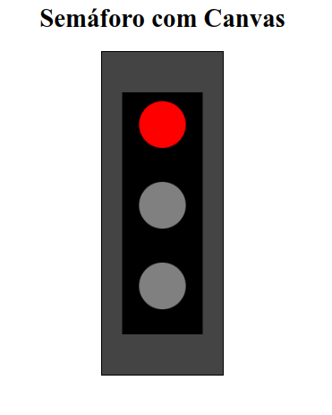

### Projeto 1: Criando um Semáforo com Círculos no Canvas

#### Objetivo
Neste tutorial, vamos aprender a criar um semáforo utilizando a tag `<canvas>` no HTML e JavaScript. Ele terá três luzes (vermelha, amarela e verde) desenhadas com círculos. Além disso, vamos adicionar uma interação onde as luzes se alternam automaticamente a cada 2 segundos.



### Passo 1: Configuração Inicial

#### Estrutura HTML

Crie um arquivo chamado `index.html` com a seguinte estrutura básica:

```html
<!DOCTYPE html>
<html lang="pt-br">
<head>
    <meta charset="UTF-8">
    <meta name="viewport" content="width=device-width, initial-scale=1.0">
    <title>Semáforo com Canvas</title>
    <style>
        canvas {
            display: block;
            margin: 20px auto;
            border: 2px solid black;
            background-color: #444;
        }
    </style>
</head>
<body>
    <h1 style="text-align: center;">Semáforo com Canvas</h1>
    <canvas id="semaforoCanvas" width="150" height="400"></canvas>
    <script src="semaforo.js"></script>
</body>
</html>
```

#### Explicação:
1. O `<canvas>` com o `id="semaforoCanvas"` será usado para desenhar o semáforo.
2. O CSS define bordas e cores de fundo para o canvas.

---

### Passo 2: Desenhando o Corpo do Semáforo

Crie um arquivo chamado `semaforo.js` e adicione o seguinte código:

```javascript
const canvas = document.getElementById("semaforoCanvas");
const ctx = canvas.getContext("2d");

// Dimensões do semáforo
const width = 100; // Largura
const height = 300; // Altura
const xPos = (canvas.width - width) / 2; // Centraliza horizontalmente
const yPos = 50; // Posição no eixo Y

// Corpo do semáforo
ctx.fillStyle = "black";
ctx.fillRect(xPos, yPos, width, height);
```

#### Explicação:
1. `fillRect(x, y, largura, altura)` desenha o retângulo representando o corpo do semáforo.
2. As posições `xPos` e `yPos` centralizam o semáforo no canvas.

---

### Passo 3: Desenhando as Luzes

Adicione ao `semaforo.js`:

```javascript
// Coordenadas das luzes
const lightRadius = 30;
const lightX = canvas.width / 2; // Posição horizontal centralizada
const lightsY = [90, 190, 290]; // Posições verticais para as luzes

// Função para desenhar uma luz
function drawLight(y, color) {
    ctx.beginPath();
    ctx.arc(lightX, y, lightRadius, 0, 2 * Math.PI);
    ctx.fillStyle = color;
    ctx.fill();
    ctx.strokeStyle = "black";
    ctx.lineWidth = 2;
    ctx.stroke();
}

// Luzes apagadas inicialmente
lightsY.forEach(y => drawLight(y, "gray"));
```

#### Explicação:
1. `arc(x, y, raio, início, fim)` desenha os círculos das luzes.
2. As luzes começam apagadas (`gray`) para representar o estado inicial.

---

### Passo 4: Adicionando a Lógica de Alternância

Agora vamos fazer as luzes alternarem automaticamente a cada 2 segundos. Adicione ao `semaforo.js`:

```javascript
let currentLight = 0; // Índice da luz atual (0 = vermelho, 1 = amarelo, 2 = verde)
const lightColors = ["red", "yellow", "green"]; // Cores das luzes

function updateTrafficLight() {
    // Apagar todas as luzes
    lightsY.forEach(y => drawLight(y, "gray"));

    // Acender a luz atual
    drawLight(lightsY[currentLight], lightColors[currentLight]);

    // Avançar para a próxima luz
    currentLight = (currentLight + 1) % lightColors.length;
}

// Alternar as luzes a cada 2 segundos
setInterval(updateTrafficLight, 2000);
```

#### Explicação:
1. `setInterval()` executa a função `updateTrafficLight` a cada 2 segundos.
2. `currentLight` alterna entre os índices 0, 1 e 2 (vermelho, amarelo e verde).
3. A lógica apaga todas as luzes antes de acender a atual.

---

### Passo 5: Testando o Semáforo

Salve os arquivos e abra o `index.html` em um navegador. O semáforo agora alterna automaticamente entre as luzes vermelho, amarelo e verde!

---

### Código Final: `semaforo.js`

```javascript
const canvas = document.getElementById("semaforoCanvas");
const ctx = canvas.getContext("2d");

// Dimensões do semáforo
const width = 100;
const height = 300;
const xPos = (canvas.width - width) / 2;
const yPos = 50;

// Corpo do semáforo
ctx.fillStyle = "black";
ctx.fillRect(xPos, yPos, width, height);

// Coordenadas das luzes
const lightRadius = 30;
const lightX = canvas.width / 2;
const lightsY = [90, 190, 290];

// Função para desenhar uma luz
function drawLight(y, color) {
    ctx.beginPath();
    ctx.arc(lightX, y, lightRadius, 0, 2 * Math.PI);
    ctx.fillStyle = color;
    ctx.fill();
    ctx.strokeStyle = "black";
    ctx.lineWidth = 2;
    ctx.stroke();
}

// Luzes apagadas inicialmente
lightsY.forEach(y => drawLight(y, "gray"));

// Alternância das luzes
let currentLight = 0;
const lightColors = ["red", "yellow", "green"];

function updateTrafficLight() {
    lightsY.forEach(y => drawLight(y, "gray")); // Apagar todas as luzes
    drawLight(lightsY[currentLight], lightColors[currentLight]); // Acender luz atual
    currentLight = (currentLight + 1) % lightColors.length; // Alternar luz
}

// Alternar as luzes a cada 2 segundos
setInterval(updateTrafficLight, 2000);
```

---

### Melhorias Futuras

- **Botão de Controle:** Adicione um botão para pausar ou reiniciar o semáforo.
- **Velocidade Ajustável:** Permita ao usuário escolher o tempo de alternância.
- **Som:** Adicione sons para cada mudança de luz.
