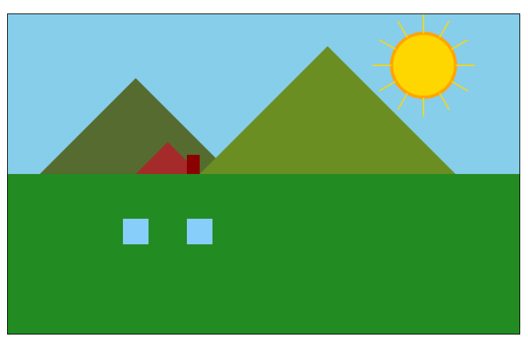

### Projeto 2: Criando uma Paisagem no Canvas

#### Objetivo
Neste tutorial, vamos aprender a desenhar uma paisagem básica usando o elemento `<canvas>` do HTML e JavaScript. A paisagem terá os seguintes elementos: 
- Um **céu** (retângulo).
- **Montanhas** (linhas).
- Uma **casa** com telhado e chaminé (retângulos e triângulo).
- Um **sol** (círculo).
- **Grama** (linhas).



---

### Passo 1: Configuração Inicial

#### Estrutura HTML

Crie um arquivo chamado `index.html` com o seguinte código:

```html
<!DOCTYPE html>
<html lang="pt-br">
<head>
    <meta charset="UTF-8">
    <meta name="viewport" content="width=device-width, initial-scale=1.0">
    <title>Paisagem com Canvas</title>
    <style>
        canvas {
            display: block;
            margin: 20px auto;
            border: 2px solid black;
        }
    </style>
</head>
<body>
    <h1 style="text-align: center;">Paisagem no Canvas</h1>
    <canvas id="paisagemCanvas" width="800" height="500"></canvas>
    <script src="paisagem.js"></script>
</body>
</html>
```

#### Explicação:
- O `<canvas>` tem 800px de largura e 500px de altura.
- Ele está centralizado com margem automática e borda para facilitar a visualização.

---

### Passo 2: Configurando o Contexto do Canvas

Crie um arquivo chamado `paisagem.js` e adicione o seguinte código:

```javascript
// Configuração inicial
const canvas = document.getElementById("paisagemCanvas");
const ctx = canvas.getContext("2d");
```

Essa parte do código identifica o canvas no HTML e configura o contexto 2D necessário para desenhar.

---

### Passo 3: Criando o Céu

Adicione ao `paisagem.js`:

```javascript
// Desenhando o céu
ctx.fillStyle = "#87CEEB"; // Azul claro
ctx.fillRect(0, 0, canvas.width, canvas.height / 2);
```

#### Explicação:
1. `fillStyle` define a cor do céu.
2. `fillRect(x, y, largura, altura)` desenha um retângulo cobrindo a metade superior do canvas.

---

### Passo 4: Desenhando as Montanhas

Adicione ao `paisagem.js`:

```javascript
// Desenhando montanhas
ctx.beginPath();
ctx.moveTo(50, 250); // Base da primeira montanha
ctx.lineTo(200, 100); // Pico da primeira montanha
ctx.lineTo(350, 250); // Final da primeira montanha
ctx.closePath();
ctx.fillStyle = "#556B2F"; // Verde escuro
ctx.fill();

ctx.beginPath();
ctx.moveTo(300, 250); // Base da segunda montanha
ctx.lineTo(500, 50); // Pico da segunda montanha
ctx.lineTo(700, 250); // Final da segunda montanha
ctx.closePath();
ctx.fillStyle = "#6B8E23"; // Verde oliva
ctx.fill();
```

#### Explicação:
1. `beginPath()` inicia um novo caminho para desenhar as montanhas.
2. `moveTo(x, y)` e `lineTo(x, y)` criam linhas conectando pontos para formar triângulos.
3. `closePath()` conecta o último ponto ao primeiro.

---

### Passo 5: Desenhando o Sol

Adicione ao `paisagem.js`:

```javascript
// Desenhando o sol
ctx.beginPath();
ctx.arc(650, 80, 50, 0, 2 * Math.PI); // Sol (círculo)
ctx.fillStyle = "#FFD700"; // Amarelo dourado
ctx.fill();
ctx.strokeStyle = "#FFA500"; // Contorno laranja
ctx.lineWidth = 5;
ctx.stroke();
```

#### Explicação:
1. `arc(x, y, raio, início, fim)` desenha o círculo representando o sol.
2. `fill()` preenche o círculo e `stroke()` adiciona um contorno.

---

### Passo 6: Desenhando a Casa

Adicione ao `paisagem.js`:

```javascript
// Desenhando a base da casa
ctx.fillStyle = "#8B4513"; // Marrom
ctx.fillRect(150, 300, 200, 150);

// Desenhando o telhado
ctx.beginPath();
ctx.moveTo(150, 300); // Canto inferior esquerdo
ctx.lineTo(250, 200); // Pico do telhado
ctx.lineTo(350, 300); // Canto inferior direito
ctx.closePath();
ctx.fillStyle = "#A52A2A"; // Vermelho telha
ctx.fill();

// Desenhando a chaminé
ctx.fillStyle = "#8B0000"; // Vermelho escuro
ctx.fillRect(280, 220, 20, 50);

// Desenhando a porta
ctx.fillStyle = "#D2691E"; // Marrom claro
ctx.fillRect(220, 370, 60, 80);
```

#### Explicação:
1. A casa é composta por um retângulo para a base, um triângulo para o telhado, outro retângulo para a chaminé e outro menor para a porta.

---

### Passo 7: Adicionando a Grama

Adicione ao `paisagem.js`:

```javascript
// Desenhando a grama
ctx.fillStyle = "#228B22"; // Verde
ctx.fillRect(0, canvas.height / 2, canvas.width, canvas.height / 2);
```

#### Explicação:
Um retângulo verde é desenhado para preencher a parte inferior do canvas, representando a grama.

---

### Passo 8: Adicionando Detalhes (Janelas e Raios do Sol)

Adicione ao `paisagem.js`:

```javascript
// Desenhando janelas
ctx.fillStyle = "#87CEFA"; // Azul claro
ctx.fillRect(180, 320, 40, 40); // Janela esquerda
ctx.fillRect(280, 320, 40, 40); // Janela direita

// Desenhando raios do sol
for (let i = 0; i < 12; i++) {
    const angle = (i * Math.PI) / 6; // Ângulo para cada raio
    const x1 = 650 + 50 * Math.cos(angle); // Ponto inicial
    const y1 = 80 + 50 * Math.sin(angle);
    const x2 = 650 + 80 * Math.cos(angle); // Ponto final
    const y2 = 80 + 80 * Math.sin(angle);

    ctx.beginPath();
    ctx.moveTo(x1, y1);
    ctx.lineTo(x2, y2);
    ctx.strokeStyle = "#FFD700";
    ctx.lineWidth = 2;
    ctx.stroke();
}
```

---

### Código Final: `paisagem.js`

```javascript
const canvas = document.getElementById("paisagemCanvas");
const ctx = canvas.getContext("2d");

// Céu
ctx.fillStyle = "#87CEEB";
ctx.fillRect(0, 0, canvas.width, canvas.height / 2);

// Montanhas
ctx.beginPath();
ctx.moveTo(50, 250);
ctx.lineTo(200, 100);
ctx.lineTo(350, 250);
ctx.closePath();
ctx.fillStyle = "#556B2F";
ctx.fill();

ctx.beginPath();
ctx.moveTo(300, 250);
ctx.lineTo(500, 50);
ctx.lineTo(700, 250);
ctx.closePath();
ctx.fillStyle = "#6B8E23";
ctx.fill();

// Sol
ctx.beginPath();
ctx.arc(650, 80, 50, 0, 2 * Math.PI);
ctx.fillStyle = "#FFD700";
ctx.fill();
ctx.strokeStyle = "#FFA500";
ctx.lineWidth = 5;
ctx.stroke();

// Casa
ctx.fillStyle = "#8B4513";
ctx.fillRect(150, 300, 200, 150);

ctx.beginPath();
ctx.moveTo(150, 300);
ctx.lineTo(250, 200);
ctx.lineTo(350, 300);
ctx.closePath();
ctx.fillStyle = "#A52A2A";
ctx.fill();

ctx.fillStyle = "#8B0000";
ctx.fillRect(280, 220, 20, 50);

ctx.fillStyle = "#D2691E";
ctx.fillRect(220, 370, 60, 80);

// Grama
ctx.fillStyle = "#228B22";
ctx.fillRect(0, canvas.height / 2, canvas.width, canvas.height / 2);

// Janelas
ctx.fillStyle = "#87CEFA";
ctx.fillRect(180, 320, 40, 40);
ctx.fillRect(280, 320, 40, 40);

// Raios do Sol
for (let i = 0; i < 12; i++) {
    const angle = (i * Math.PI) / 6;
    const x1 = 650 + 50 * Math.cos(angle);
    const y1 = 80 + 50 * Math.sin(angle);
    const x2 = 650 + 80 * Math.cos(angle);
    const y2 = 80 + 80 * Math.sin(angle);

    ctx.beginPath();
    ctx.moveTo(x1, y1);
    ctx.lineTo(x2, y2);
    ctx.strokeStyle = "#FFD700";
    ctx.lineWidth = 2;
    ctx.stroke();
}
```

---

### Resultado Final
Salve os arquivos e abra o `index.html` no navegador. Você verá uma paisagem com céu, montanhas, sol, grama e uma casa.

### Melhorias Futuras
- **Nuvens:** Adicione círculos para criar nuvens no céu.
- **Árvores:** Use retângulos e círculos para desenhar árvores.
